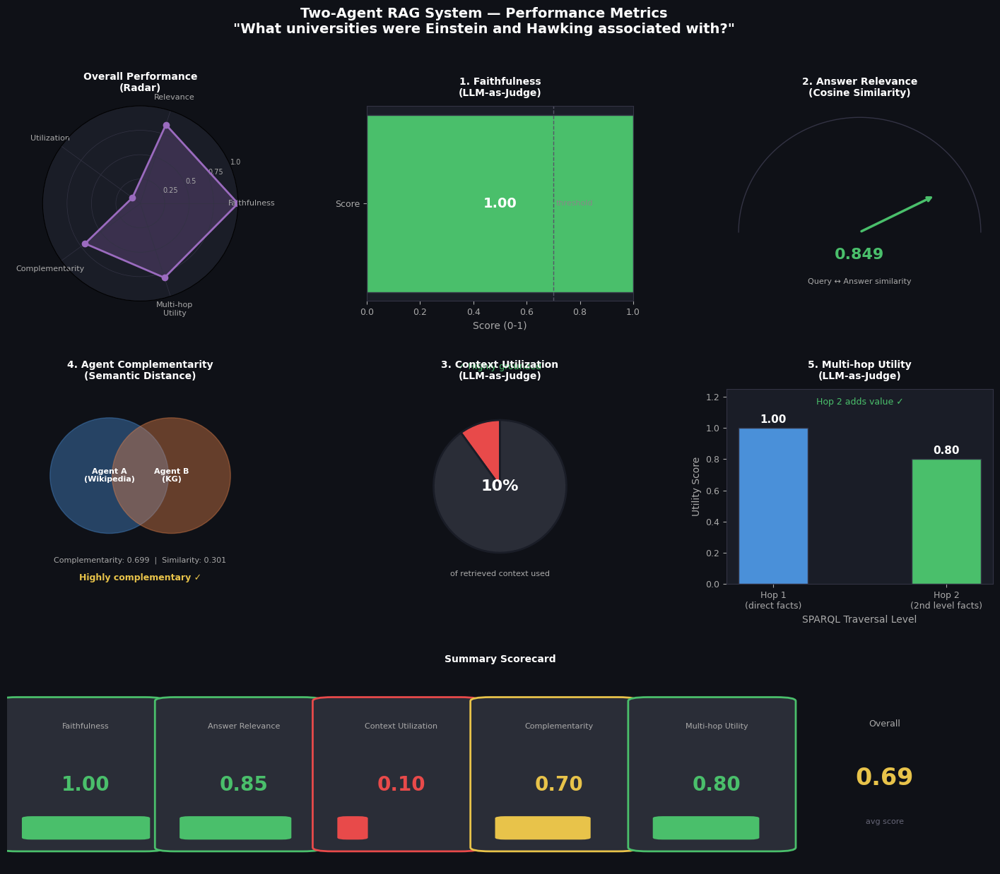

# Two-Agent RAG System - Wikipedia + Wikidata

A question answering system that uses two completely different retrieval strategies and combines them into one grounded answer.

---

## What this project does

Most RAG systems retrieve from one source - usually a bunch of documents. This project asks a different question: **what if two agents retrieved from fundamentally different types of knowledge, and a judge combined them?**

Agent A searches Wikipedia articles using vector similarity. It finds the most relevant paragraphs and uses an LLM to generate a contextual, narrative answer.

Agent B queries Wikidata using SPARQL. It traverses a real Knowledge Graph across two hops, collecting structured facts like relationships, employers, awards, and fields of work.

A judge then synthesizes both into one answer that is factually grounded and contextually rich.

The core idea is that **text search gives you context, knowledge graphs give you facts — and neither alone is enough.**

---

## Architecture

```
User Query
    │
    ├── Agent A (LangChain + ChromaDB)
    │   Wikipedia text → chunked → embedded → vector search → LLM answer
    │
    ├── Agent B (SPARQL + Wikidata)
    │   Entity extraction → Wikidata QID → 2-hop SPARQL traversal → subgraph
    │
    └── Judge (Groq LLM)
        Combines both → final grounded answer
```

The whole flow is orchestrated using **LangGraph** - each agent is a node, information flows through edges. This makes the system easy to extend, debug, and reason about.

---

## Metrics



| Metric | Score | What it means |
|--------|-------|---------------|
| Faithfulness | 1.00 | Every claim traces back to retrieved sources - no hallucination |
| Answer Relevance | 0.849 | Final answer stays tightly on topic |
| Context Utilization | 0.10 | Agent B over-fetches - subgraph pruning is the next step |
| Agent Complementarity | 0.699 | The two agents retrieve genuinely different knowledge 70% of the time |
| Multi-hop Utility | 0.800 | The second SPARQL hop adds real value beyond direct facts |
| **Overall** | **0.690** | |

The most interesting finding: complementarity at 0.699 validates the whole premise,  the two agents are not doing the same thing. They cover different parts of the answer space, which is exactly what you want in a multi-agent system.

The low context utilization (0.10) is an honest limitation. The SPARQL query retrieves 30 triples but the judge uses only a handful. The natural next step is **relevance-aware subgraph pruning** ranking triples by semantic similarity to the query before passing them to the judge. That's an open research problem.

---

## Stack

Everything here is free and runs locally or on free tiers:

- **LangChain** — document loading, chunking, vector retrieval pipeline
- **LangGraph** — agent orchestration as a directed graph
- **ChromaDB** — local vector store, no server needed
- **sentence-transformers** — local embeddings, no API needed (`all-MiniLM-L6-v2`)
- **Wikidata SPARQL** — free public Knowledge Graph endpoint, no key needed
- **Groq** — free LLM API (Llama 3.3 70B)
- **Wikipedia API** — free article fetching

Total cost: zero.

---

## How to run

**1. Clone the repo**
```bash
git clone https://github.com/yourusername/two-agent-rag-kg.git
cd two-agent-rag-kg
```

**2. Install dependencies**
```bash
pip install -r requirements.txt
```

**3. Get a free Groq API key**

Sign up at [groq.com](https://groq.com) → API Keys → Create key.

**4. Open the notebook**
```bash
jupyter notebook project.ipynb
```


---

## Example queries

These queries show the contrast between agents most clearly:

```python
# Agent B dominates — rich Wikidata entity
query = "Who is Alan Turing and what is he known for?"

# Agent A dominates — narrative discovery story  
query = "How did Marie Curie discover Polonium and Radium?"

# Both contribute equally — best demo query
query = "What did Isaac Newton contribute to mathematics and physics?"

# Tests 2-hop SPARQL — institutional connections
query = "What universities were Einstein and Hawking associated with?"
```

---

## What I'd build next

- **Subgraph pruning** : Rank the 30 retrieved triples by relevance to the query, pass only top 10 to judge. This would fix the low context utilization score.
- **SPARQL query generation** :  Instead of fixed property lookups, use the LLM to write the SPARQL query dynamically based on the question.
---

## Why this matters

The tension between symbolic knowledge (graphs, structured facts) and neural knowledge (embeddings, language models) is a live research problem. This project is a small working demo of that tension. It doesn't solve it, but it makes it visible and measurable.

---

*Built in a weekend. All free tools. No fluff.*
